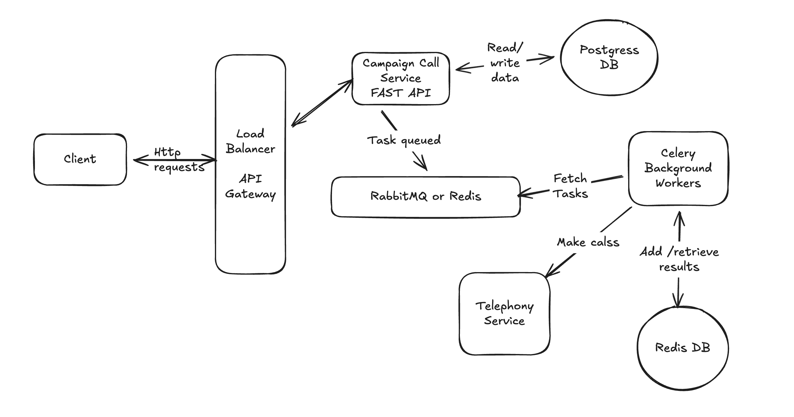

# System Design Document
## Campaign Calls Microservice

---

## High-Level Architecture

### Architecture Diagram



---

## Component Interaction

### 1. Campaign Creation Flow
```
Client → FastAPI → PostgreSQL
  1. POST /campaigns with phone numbers
  2. FastAPI validates request
  3. Creates campaign record in database
  4. Creates call records for each phone number
  5. Returns campaign details to client
```

### 2. Campaign Execution Flow
```
Client → FastAPI → Redis → Celery Workers → PostgreSQL
  1. POST /campaigns/{id}/start
  2. FastAPI queues "start_campaign" task to Redis
  3. Returns immediately (async processing)
  
Background Processing:
  4. Celery worker picks up task from Redis
  5. Worker checks concurrency limit (queries PostgreSQL)
  6. Worker queues "process_call" tasks (up to concurrency limit)
  7. Workers make calls via Telephony service
  8. Workers update call status in PostgreSQL
  9. Workers queue next calls as slots become available
  10. Process continues until all calls complete
```

### 3. Concurrency Control
```
Worker → PostgreSQL (check limit) → Redis (queue next call)
  1. Before processing call: COUNT calls WHERE status='IN_PROGRESS'
  2. If count < max_concurrent_calls: process next call
  3. After call completes: automatically queue next pending call
  4. Per-campaign isolation: each campaign has its own limit
```

---

## Technology Choices

### 1. **PostgreSQL** (Database)

**Why:**
- ACID transactions ensure data consistency
- Supports complex queries (JOINs between campaigns and calls)
- Foreign key constraints prevent data corruption
- JSON column for flexible business hours configuration
- Reliable for concurrency control

**Use Case:**
- Store campaigns and calls
- Track call status and statistics
- Enforce data integrity with constraints

### 2. **Redis** (Message Broker)

**Why:**
- Simple to deploy and operate
- Fast in-memory data store
- Sufficient for task queue workload
- Lower overhead than RabbitMQ
- Built-in persistence options

**Use Case:**
- Queue asynchronous tasks
- Enable communication between API and workers

### 3. **Celery** (Task Scheduler/Worker)

**Why:**
- Industry standard for Python background tasks
- Built-in retry mechanisms
- Task scheduling (delayed execution for business hours)
- Scales horizontally (add more workers)
- Monitoring tools available (Flower)

**Use Case:**
- Process calls asynchronously (5-30 seconds each)
- Handle retries with configurable delays
- Schedule calls for business hours
- Manage concurrent call processing

### 4. **FastAPI** (API Framework)

**Why:**
- Modern, fast Python framework
- Automatic API documentation (OpenAPI/Swagger)
- Built-in request validation (Pydantic)
- Type hints for better code quality

**Use Case:**
- Expose REST API endpoints
- Handle user requests
- Queue background tasks

---

## Fault Tolerance

### 1. Database Level
- **ACID Transactions**: All operations are atomic (all-or-nothing)
- **Connection Pooling**: Automatic reconnection on failure
- **Foreign Key Constraints**: Prevent orphaned call records

### 2. Task Queue Level
- **Task Requeuing**: If worker crashes, task returns to queue
- **Automatic Retry**: Failed calls automatically retried (configurable)
- **Idempotent Tasks**: Safe to execute same task multiple times

### 3. Application Level
- **Graceful Error Handling**: Exceptions caught and logged
- **Status Tracking**: Every state change persisted to database
- **Retry Logic**: Failed calls retried with delay (e.g., 5 minutes)

### 4. Worker Resilience
```python
# Celery configuration
task_acks_late=True  # Task only removed from queue after completion
# If worker crashes mid-task, another worker picks it up
```

**Result:** No data loss or corruption even if components fail

---

## Scalability

### Horizontal Scaling (Add More Instances)

```
                Load Balancer
                     │
        ┌────────────┼────────────┐
        ▼            ▼            ▼
    API-1        API-2        API-3
        │            │            │
        └────────────┼────────────┘
                     │
        ┌────────────┼────────────┐
        ▼            ▼            ▼
   PostgreSQL     Redis       Workers×N
```

### 1. **API Servers** (Stateless)
- Add more FastAPI instances behind load balancer
- Each instance independent
- Capacity: 1 instance = ~1,000 req/s

**Scale to:** 10 instances = 10,000 req/s

### 2. **Celery Workers**
- Add more worker processes
- Each pulls tasks from shared Redis queue
- No coordination needed between workers

**Scale to:** 100 workers = 100+ concurrent calls

### 3. **Database**
- Add read replicas for statistics queries
- Increase connection pool size
- Vertical scaling (larger instance)

**Scale to:** Handle 5,000+ writes/second

### 4. **Redis**
- Redis Sentinel for high availability
- Redis Cluster for horizontal scaling

**Scale to:** Handle 100,000+ ops/second

### Per-Campaign Isolation
- Each campaign has its own concurrency limit
- Multiple campaigns run independently
- Database queries filter by campaign_id
- No interference between campaigns

**Result:** System can handle hundreds of concurrent campaigns

---

## Summary

**Architecture:** API → Database + Message Queue → Workers  
**Technologies:** FastAPI, PostgreSQL, Redis, Celery  
**Fault Tolerance:** ACID transactions, task requeuing, retry logic  
**Scalability:** Horizontal scaling of all components, stateless design  
